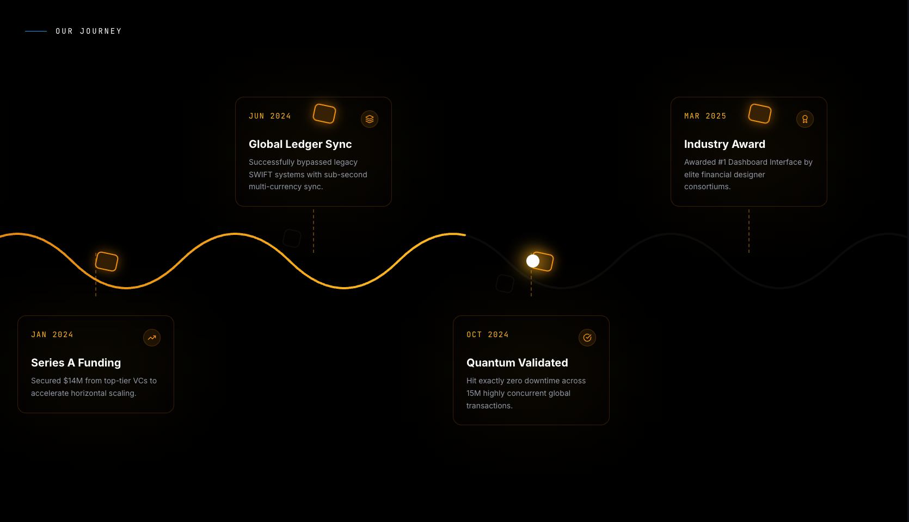
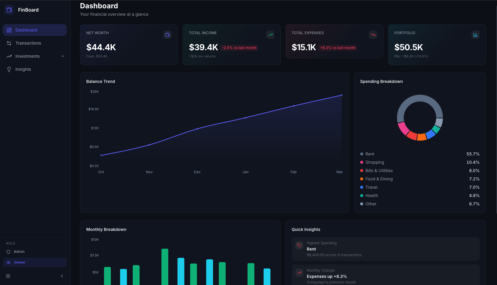
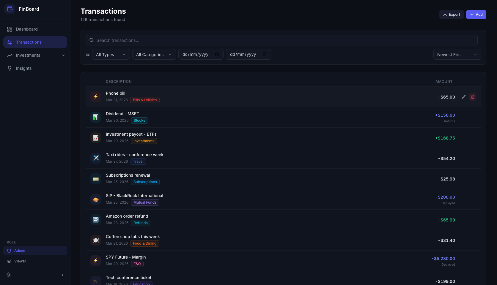
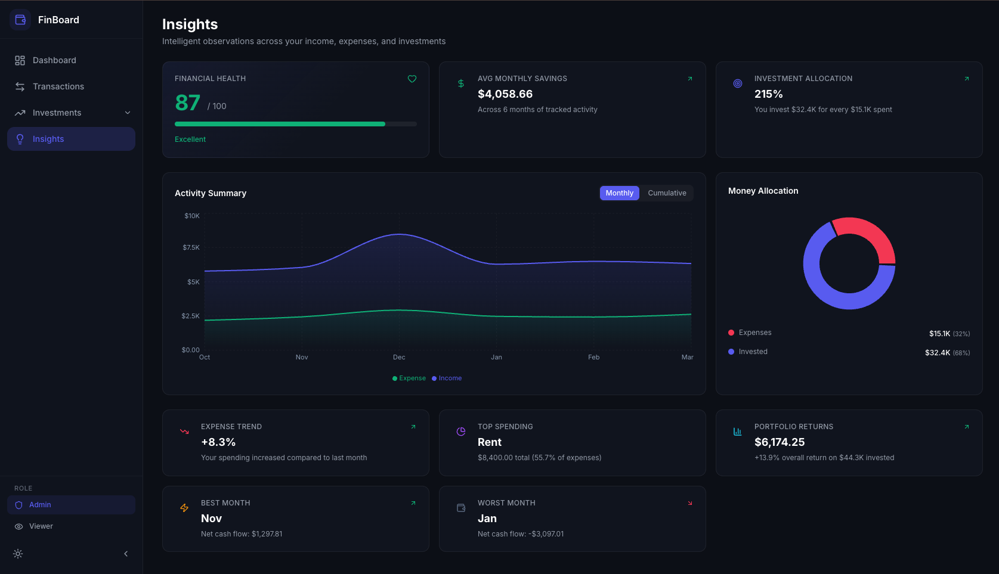
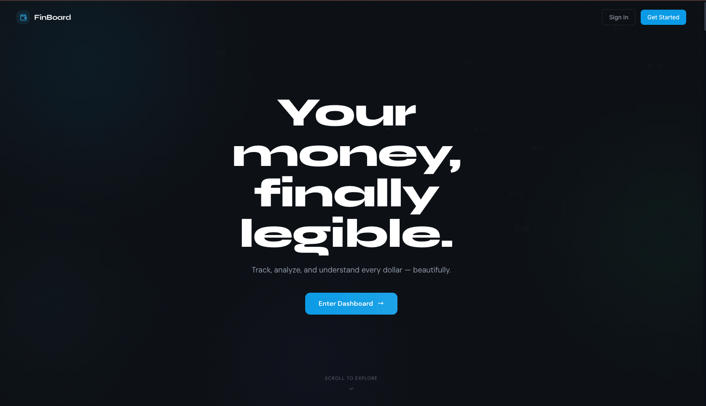
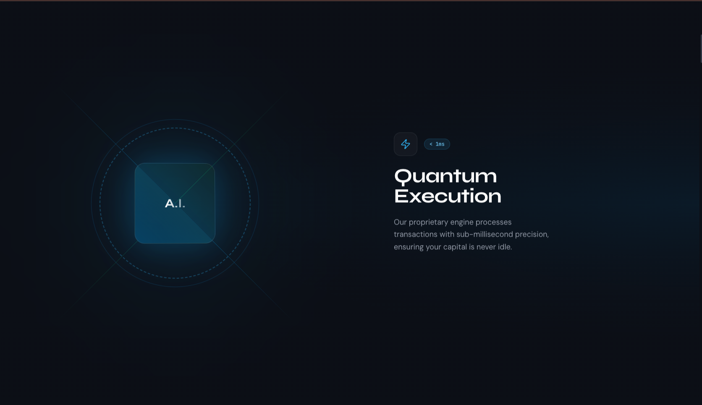
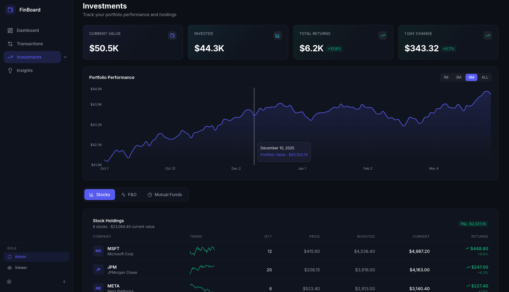
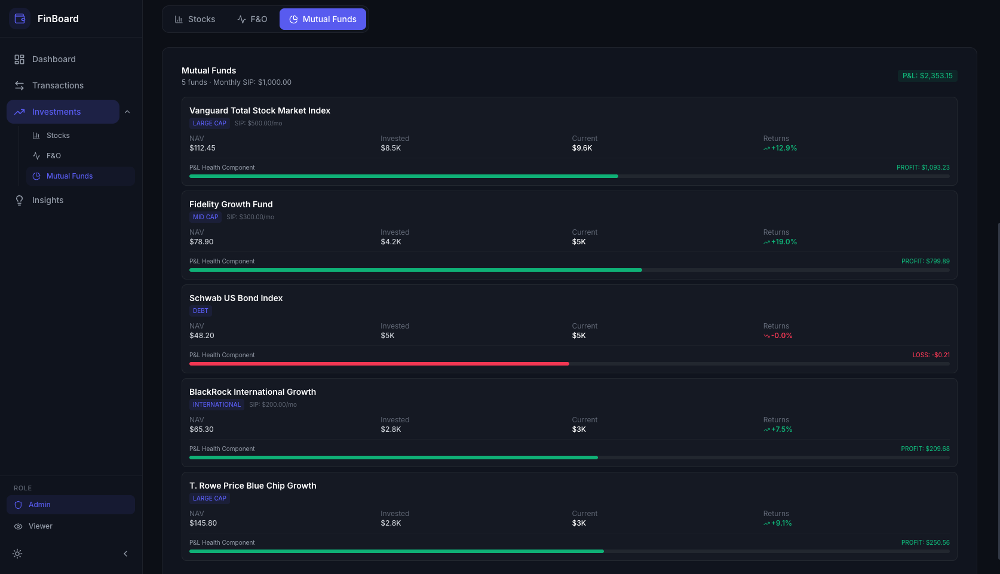
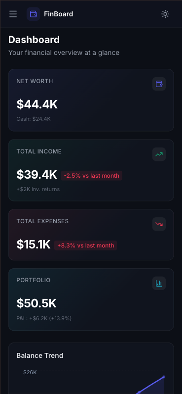

<div align="center">

```
███████╗██╗███╗   ██╗██████╗  ██████╗  █████╗ ██████╗ ██████╗ 
██╔════╝██║████╗  ██║██╔══██╗██╔═══██╗██╔══██╗██╔══██╗██╔══██╗
█████╗  ██║██╔██╗ ██║██████╔╝██║   ██║███████║██████╔╝██║  ██║
██╔══╝  ██║██║╚██╗██║██╔══██╗██║   ██║██╔══██║██╔══██╗██║  ██║
██║     ██║██║ ╚████║██████╔╝╚██████╔╝██║  ██║██║  ██║██████╔╝
╚═╝     ╚═╝╚═╝  ╚═══╝╚═════╝  ╚═════╝ ╚═╝  ╚═╝╚═╝  ╚═╝╚═════╝ 
```

### *Your financial story, beautifully told.*

<br />

[](https://react.dev)
[](https://www.typescriptlang.org)
[](https://vitejs.dev)
[](https://tailwindcss.com)
[](https://zustand.docs.pmnd.rs)
[](https://greensock.com/gsap)
[](https://recharts.org)

<br/>


</div>

---

## ✦ What is FinBoard?

**FinBoard** is a production-grade, full-spectrum personal finance dashboard that transforms raw transaction data into a living picture of your financial health. It tracks income, expenses, **and** investments — from stock holdings and F&O positions to mutual fund SIPs — all unified under a single, beautifully crafted interface.

Built as a frontend-first application with zero backend dependency, it delivers an experience that feels anything but mock — dark by default, scroll-animated on the landing page, insight-forward by design, and polished at every pixel.

> Built as a Personal Project — but designed like a product you'd actually ship.

---

## ✦ The Experience at a Glance

<div align="center">

| Landing | Dashboard | Investments |
|---|---|---|
|  |  |  |

| Transactions | Insights |
|---|---|
|  |  |

</div>

---

## ✦ Feature Highlights

### 🚀 Cinematic Landing Page
A scroll-driven, GSAP-animated entry experience that sets the tone before a single data point loads:

- **Hero Section** — Word-by-word staggered reveal with floating data particles, reduced-motion aware
- **Sticky Showcase** — Pinned scroll section with a 3D rotating core ring, presenting FinBoard's pillars (Quantum Execution, Adaptive Intelligence, etc.)
- **Feature Strip** — Horizontal scroll-linked sine-wave path with 10 feature cards, connector lines, and chain-bead SVG animations
- **Horizontal Journey** — GSAP-pinned timeline of FinBoard milestones, smooth-scrubbed left-to-right
- **Live Stats Row** — Counters that animate from zero using real transaction data (transaction count, category count, savings rate)
- **Final CTA** — Gradient call-to-action that whisks you into the dashboard

### 🏠 Dashboard Overview
The nerve center of your finances. At a glance:

| Card | What it tells you |
|---|---|
| **Total Balance** | Your cumulative net position (income − expenses − investments) |
| **Total Income** | Aggregated earnings across all sources |
| **Total Expenses** | Spend totals with month-over-month delta |
| **Savings Rate** | The percentage of income actually saved |

Three live visualizations back these numbers up:
- **Balance Trend** — A smooth area chart tracing your financial trajectory over 6 months
- **Spending Breakdown** — A donut chart slicing expenses across categories with an auto-grouping "Other" overflow for smaller categories
- **Monthly Income vs Expenses** — Side-by-side grouped bars for each month (income, expenses, and investments), making surpluses and deficits instantly readable

### 💳 Transactions
A searchable, filterable, sortable ledger of **126 transactions** — income, expenses, and investments:

- 🔍 **Search** by description, merchant, or keyword
- 🏷️ **Filter** by type (Income / Expense / Investment) and by category
- 📅 **Date range** picker to scope any window of time
- ↕️ **Sort** by: Newest First · Oldest First · Highest Amount · Lowest Amount · Category A–Z
- 📤 **Export** transactions to CSV/JSON with one click
- 📱 **Responsive filters** — collapse behind a toggle button on mobile to preserve reading space

Every transaction shows its date, category badge (color-coded), icon, description, and signed amount — green for income, red for expense, cyan for investment.

### 📈 Investments
A full portfolio management interface with three instrument tabs:

| Tab | What you see |
|---|---|
| **Stocks** | 8 holdings with qty, avg buy price, current price, daily change %, sparkline mini-charts, and per-stock P&L |
| **F&O** | Options and futures positions with strike price, premium, lots, expiry dates, LTP, and live P&L |
| **Mutual Funds** | SIP and lump-sum holdings with NAV, units, invested vs. current value, returns %, and accessible PROFIT/LOSS text labels |

Anchored by:
- **Portfolio Summary** — Current value, total invested, returns (absolute + %), and daily change
- **Performance Chart** — An interactive area chart with 1M / 3M / 6M / ALL period toggles, tracking portfolio value over time

### 💡 Insights
Intelligent, auto-computed observations that fuse income, expenses, and investments into a unified financial picture:

- ❤️ **Financial Health Score** — A composite 0–100 score weighted across savings ratio, investment discipline, portfolio returns, spending control, and diversification
- 💰 **Avg Monthly Savings** — Net savings averaged across all tracked months
- 🎯 **Investment Allocation** — Ratio of invested capital vs. total expenditure
- 📉 **Expense Trend** — Month-over-month change, signed and colored
- 🥇 **Top Spending Category** — With total and percentage of expenses
- 📊 **Portfolio Returns** — Total returns from the investment portfolio
- ⚡ **Best / Worst Month** — Identified by net cash flow
- ⚠️ **Unusual Activity Detection** — Alerts when latest month deviates >30% from the average

Backed by two deep charts:
- **Activity Summary** — Monthly income vs. expense area chart with a cumulative toggle
- **Money Allocation** — Donut chart splitting expenses, investments, and savings

### 🔐 Role-Based UI
Roles are simulated on the frontend and toggle instantly from the sidebar:

| Role | Capabilities |
|---|---|
| **Admin** | View all data · Add transactions · Edit/delete existing entries |
| **Viewer** | Read-only access · No mutation controls shown |

Switch between roles mid-session — the UI adapts in real time.

### 🌓 Theme System
Dark mode by default with a one-click toggle to light mode. Theme preference persists across sessions via `localStorage`. The entire design system — surfaces, borders, text, shadows, and chart palettes — adapts seamlessly.

---

## ✦ Tech Stack

```
FinBoard
├── React 19              → Component model & rendering
├── TypeScript 5.9        → End-to-end type safety
├── Vite 8                → Lightning-fast dev server & bundler
├── Tailwind CSS 3.4      → Utility-first styling with dark mode
├── Zustand 5             → Minimal, scalable state management
├── React Router 7        → Client-side routing (Landing → Dashboard → pages)
├── Recharts 3            → Composable, animated data visualizations
├── GSAP 3 + ScrollTrigger→ Scroll-driven animations on the landing page
├── Framer Motion         → Page transitions and micro-animations
├── Lucide React          → Consistent icon system (50+ icons used)
├── clsx                  → Conditional className composition
├── date-fns              → Date formatting and manipulation
└── localStorage          → Persistence across sessions
```

---

## ✦ Architecture & Design Decisions

### State Management — Zustand
FinBoard uses **Zustand** for global state — a lightweight, hook-first store without the boilerplate overhead of Redux or the prop-drilling of Context. The store is a single `create()` call with cleanly segmented concerns:

```
financeStore
├── transactions[]           → Source of truth for all financial data
├── investments              → { stocks[], fno[], mutualFunds[], portfolio, performance[] }
├── filters                  → { search, type, category, dateFrom, dateTo, sortBy, sortDir }
├── activeView               → 'dashboard' | 'transactions' | 'investments' | 'insights'
├── role                     → 'admin' | 'viewer'
├── theme                    → 'dark' | 'light'
├── sidebarOpen              → boolean
├── editingTxn / showTxnForm → modal state for CRUD
└── actions                  → load, add, update, delete, setFilters, toggleTheme, etc.
```

Derived values (totals, monthly breakdown, category breakdown, investment breakdown) are computed via **selector functions outside the store** and memoized with `useMemo` at the component level — preventing unnecessary re-renders across unrelated state slices.

### Client-Side Routing
React Router provides clean URL-based navigation:

| Route | View |
|---|---|
| `/` | Landing page (cinematic scroll experience) |
| `/dashboard` | Dashboard with stat cards & charts |
| `/transactions` | Full transaction ledger |
| `/investments` | Portfolio with Stocks / F&O / Mutual Funds tabs |
| `/insights` | Financial health score & analytics |
| `*` | Redirects to landing |

The internal pages (`/dashboard`, `/transactions`, `/investments`, `/insights`) are wrapped in an `AppShell` that handles data loading and provides the sidebar layout.

### Data Persistence — localStorage
All transactions added or edited by Admin are written to `localStorage`. On mount, the store hydrates from storage — falling back gracefully to the bundled seed dataset if nothing is found (or if the data version has been bumped). This means your data survives page refreshes without any backend.

### Hydration-Safe Chart Rendering
All Recharts `<ResponsiveContainer>` instances are guarded by a custom `useMounted()` hook that defers rendering until after client-side hydration. This eliminates the common `width(-1)` ResizeObserver flicker that occurs when charts mount before their parent container has calculated dimensions.

### Role-Based Rendering
RBAC is implemented as a conditional rendering pattern. The store exposes the current `role`, and components use it to gate Admin-only controls (Add Transaction button, Edit/Delete actions). No routes are hidden — the UI simply removes affordances the Viewer has no business seeing.

### Responsive Layout
- **Mobile** (`< 768px`): Single column, collapsible sidebar, stacked cards, filters behind toggle
- **Tablet** (`768px–1024px`): Two-column grid, condensed charts
- **Laptop / Desktop** (`> 1024px`): Full sidebar + multi-column dashboard
- **Large Screens** (`> 1440px`): Expanded chart canvases, wider spacing

---

## ✦ Getting Started

### Prerequisites

- **Node.js** ≥ 18.x
- **npm** ≥ 9.x (or pnpm / yarn)

### Installation

```bash
# Clone the repository
git clone https://github.com/Anish1279/FinBoard.git
cd FinBoard

# Install dependencies
npm install

# Start the development server
npm run dev
```

Open [http://localhost:5173](http://localhost:5173) — the landing page loads with full GSAP animations. Click "Enter Dashboard" to explore.

### Build for Production

```bash
npm run build       # Type-checks with tsc, then outputs to /dist
npm run preview     # Locally preview the production build
```

### Lint

```bash
npm run lint        # ESLint with TypeScript-aware rules
```

---

## ✦ Project Structure

```
finboard/
├── public/                      # Static assets & screenshots
├── src/
│   ├── components/
│   │   ├── dashboard/           # StatCards, BalanceTrend, CategoryBreakdown,
│   │   │                        #   MonthlyComparison, QuickInsights, DashboardView
│   │   ├── transactions/        # TxnTable, TxnRow, TxnFilters, TxnForm
│   │   ├── investments/         # InvestmentsView, StockHoldings, FnOPositions,
│   │   │                        #   MutualFunds, PerformanceChart, PortfolioSummary,
│   │   │                        #   SparklineChart
│   │   ├── insights/            # InsightsView, ActivityChart, AllocationChart
│   │   ├── landing/             # Hero, StickyShowcase, FeatureStrip,
│   │   │                        #   HorizontalJourney, CurvedJourney, StatsRow, FinalCTA
│   │   ├── layout/              # Shell, Sidebar, TopBar
│   │   └── ui/                  # Button, Badge, Card, Modal, EmptyState,
│   │                            #   Skeleton, ThemeToggle
│   ├── hooks/
│   │   ├── use-breakpoint.ts    # Responsive breakpoint detection
│   │   ├── use-debounce.ts      # Input debouncing
│   │   └── use-mounted.ts       # Hydration-safe render deferral
│   ├── lib/
│   │   ├── constants.ts         # Categories (17), filter defaults, storage keys
│   │   ├── formatters.ts        # Currency, percentage, date formatting
│   │   ├── export.ts            # CSV + JSON export logic
│   │   ├── mock-data.ts         # 126 seeded transactions across 6 months
│   │   ├── investment-data.ts   # Stocks, F&O, mutual funds, portfolio, performance
│   │   ├── mock-api.ts          # Simulated async API layer with localStorage
│   │   └── types.ts             # Transaction, Investment, Filter, Role, etc.
│   ├── pages/
│   │   └── LandingPage.tsx      # Landing page composition
│   ├── store/
│   │   └── finance.ts           # Zustand store with actions & selectors
│   ├── App.tsx                  # Router + theme sync
│   ├── main.tsx                 # Entry point
│   └── index.css                # Tailwind directives + custom design tokens
├── index.html
├── tailwind.config.js
├── tsconfig.app.json
└── vite.config.ts
```

---

## ✦ Mock Data

The app ships with **126 realistic transactions** spanning October 2025 – March 2026, distributed across **17 categories** in three types:

**Income** (4 categories)

| Category | Color | Icon |
|---|---|---|
| Salary | 🟢 Emerald | Briefcase |
| Freelance | 🟣 Indigo | Laptop |
| Investments | 🟡 Amber | TrendingUp |
| Refunds | 🩵 Cyan | RotateCcw |

**Expense** (10 categories)

| Category | Color | Icon |
|---|---|---|
| Food & Dining | 🟠 Orange | UtensilsCrossed |
| Shopping | 🩷 Pink | ShoppingBag |
| Bills & Utilities | 🔴 Red | Zap |
| Entertainment | 🟣 Purple | Gamepad2 |
| Travel | 🔵 Blue | Plane |
| Health | 🩵 Teal | Heart |
| Education | 💜 Violet | GraduationCap |
| Rent | ⬜ Slate | Home |
| Subscriptions | 🔵 Sky | CreditCard |
| Other | ⬜ Gray | MoreHorizontal |

**Investment** (3 categories)

| Category | Color | Icon |
|---|---|---|
| Stocks | 🩵 Cyan | BarChart3 |
| F&O | 🩷 Pink | Activity |
| Mutual Funds | 💜 Lavender | PieChart |

Additionally, the investment data module includes **8 stock holdings**, **4 F&O positions**, **5 mutual fund schemes**, a precomputed portfolio summary, and **260 daily performance data points** for the portfolio chart.

---

## ✦ Screenshots

<div align="center">

| Landing Hero | Sticky Showcase |
|---|---|
|  |  |

| Dashboard | Transactions |
|---|---|
|  |  |

| Investments - Stocks | Mutual Funds |
|---|---|
|  |  |

| Insights | Mobile View |
|---|---|
|  |  |

</div>

---

## ✦ License

© 2026 Anish Singh. All Rights Reserved.

---

<div align="center">

*Crafted with care — because good finance tools should feel good to use.*

**FinBoard** · React + TypeScript + Zustand + GSAP · Built to impress

</div>
